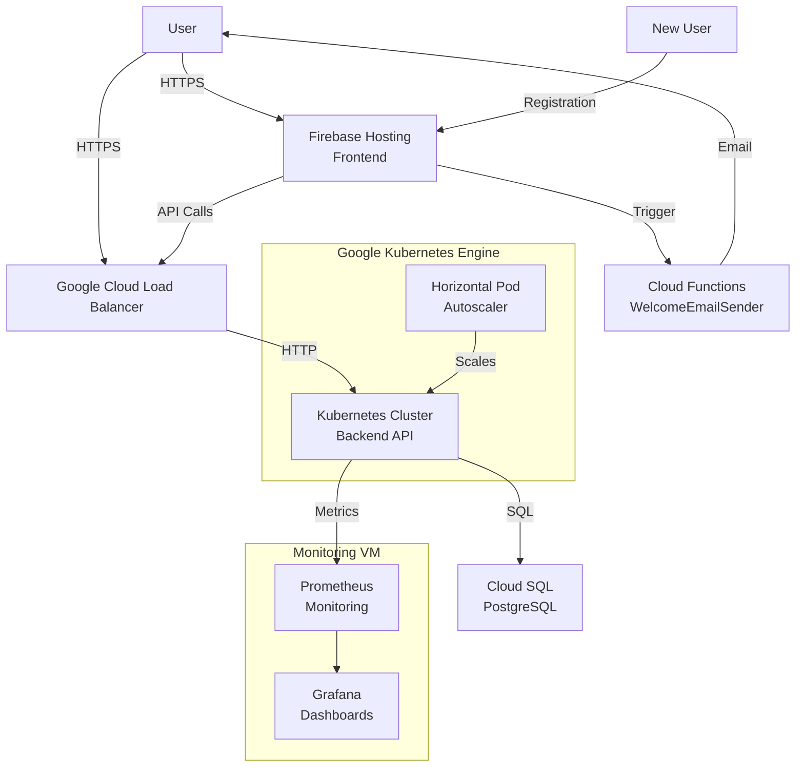

# ReactFast Contacts - Project Report

## 1. Introduction

ReactFast Contacts is a modern, production-ready contact management application built with React, FastAPI, and deployed on Google Cloud Platform. The application demonstrates best practices for cloud-native development, including containerization, orchestration, authentication, and monitoring. This report provides a comprehensive overview of the project architecture, deployment process, and performance testing results.

## 2. Project Overview

### 2.1 Application Purpose

ReactFast Contacts is a comprehensive contact management application that allows users to:
- Create, view, edit, and delete contacts
- Manage their contact information through an intuitive interface
- Access their contacts securely from anywhere

The application showcases a production-ready architecture using modern web technologies with a mobile phone-like layout for the user interface.

### 2.2 Technology Stack

#### Frontend
- **React**: JavaScript library for building user interfaces
- **Tailwind CSS**: Utility-first CSS framework
- **Firebase Authentication**: User authentication service
- **React Router**: Navigation for React applications
- **Axios**: HTTP client for making API requests

#### Backend
- **FastAPI**: Modern, high-performance Python web framework
- **SQLAlchemy**: SQL toolkit and ORM for Python
- **Prometheus FastAPI Instrumentator**: Metrics collection for FastAPI
- **Pydantic**: Data validation and settings management
- **Uvicorn**: ASGI server for FastAPI

#### Database
- **PostgreSQL**: Open-source relational database

#### DevOps & Deployment
- **Docker**: Containerization platform
- **Kubernetes**: Container orchestration platform
- **Google Kubernetes Engine (GKE)**: Managed Kubernetes service
- **Cloud SQL**: Managed PostgreSQL database
- **Firebase Hosting**: Web application hosting
- **Firebase Cloud Functions**: Serverless functions for backend logic
- **Cloud Load Balancer**: Load balancing for traffic distribution
- **Prometheus & Grafana**: Monitoring and visualization

## 3. Architecture

The application follows a modern cloud-native architecture with three primary layers:

### 3.1 Architecture Diagram



### 3.2 Frontend Layer
- React Single-Page Application (SPA)
- Hosted on Firebase Hosting
- Firebase Authentication for user management
- Communicates with backend via REST API
- Mobile-responsive design with Tailwind CSS

### 3.3 API Layer
- FastAPI application running on GKE
- Horizontally scaled with Kubernetes
- Load balanced with Google Cloud Load Balancer
- Secured with SSL/TLS
- Prometheus instrumentation for monitoring

### 3.4 Database Layer
- PostgreSQL on Cloud SQL
- Connected to backend via Cloud SQL Proxy
- Credentials managed securely with Kubernetes Secrets

### 3.5 Infrastructure
- Containerization with Docker
- Orchestration with Kubernetes
- Autoscaling based on CPU and memory utilization
- Custom domain with TLS certificate
- Monitoring with Prometheus and Grafana

## 4. Deployment Process

### 4.1 Google Cloud Platform Setup

The application is deployed to Google Cloud Platform using the following components:

1. **GCP Project Creation**:
   ```bash
   gcloud projects create cs436-reactfastcontacts --name="ReactFast Contacts"
   gcloud config set project cs436-reactfastcontacts
   ```

2. **API Enablement**:
   ```bash
   gcloud services enable compute.googleapis.com \
     container.googleapis.com \
     sqladmin.googleapis.com \
     cloudbuild.googleapis.com \
     containerregistry.googleapis.com \
     firebase.googleapis.com
   ```

3. **Service Account Configuration**:
   ```bash
   gcloud iam service-accounts create cloud-sql-proxy \
     --display-name="Cloud SQL Proxy"
   
   gcloud projects add-iam-policy-binding cs436-reactfastcontacts \
     --member="serviceAccount:cloud-sql-proxy@cs436-reactfastcontacts.iam.gserviceaccount.com" \
     --role="roles/cloudsql.client"
   ```

### 4.2 Database Deployment

1. **Cloud SQL Instance Creation**:
   ```bash
   gcloud sql instances create contacts-db \
     --database-version=POSTGRES_13 \
     --tier=db-f1-micro \
     --region=us-central1 \
     --storage-type=SSD \
     --storage-size=10GB
   ```

2. **Database and User Setup**:
   ```bash
   gcloud sql databases create contacts --instance=contacts-db
   gcloud sql users create contacts-user --instance=contacts-db
   ```

### 4.3 Backend Deployment

1. **Docker Image Creation**:
   ```bash
   cd backend
   docker build -t gcr.io/cs436-reactfastcontacts/contacts-backend:latest .
   gcloud auth configure-docker
   docker push gcr.io/cs436-reactfastcontacts/contacts-backend:latest
   ```

2. **GKE Cluster Creation**:
   ```bash
   gcloud container clusters create contacts-cluster \
     --zone us-central1-a \
     --num-nodes 3 \
     --machine-type e2-standard-2
   ```

3. **Kubernetes Deployment**:
   ```bash
   kubectl apply -f kubernetes/db-credentials.yaml
   kubectl apply -f kubernetes/backend-deployment-latest.yaml
   kubectl apply -f kubernetes/backend-service.yaml
   kubectl apply -f kubernetes/certificate.yaml
   kubectl apply -f kubernetes/ingress.yaml
   kubectl apply -f kubernetes/autoscale.yaml
   ```

### 4.4 Frontend Deployment

1. **Firebase Project Setup**:
   - Created a Firebase project linked to the GCP project
   - Enabled Authentication with Email/Password provider

2. **Frontend Deployment**:
   ```bash
   cd frontend
   npm install
   npm run build
   firebase deploy --only hosting
   ```

### 4.5 Domain and SSL Configuration

1. **Custom Domain Setup**:
   - Configured `api.ataagri.com` for the backend API
   - Configured `cs436-reactfastcontacts.web.app` for the frontend

2. **SSL Certificate Management**:
   - Used Google-managed certificates for the backend API
   - Firebase automatically provides SSL for the frontend

## 5. Performance Testing

### 5.1 Testing Methodology

We conducted extensive performance testing to evaluate the application's behavior under different load conditions and with different pod configurations. The testing was performed using Locust, a Python-based load testing tool.

#### Test Scenarios

1. **Baseline Test**: Minimal load to establish baseline performance
2. **Low Load Test**: 20 users with a spawn rate of 5 users/second for 2 minutes
3. **Medium Load Test**: 100 users with a spawn rate of 10 users/second for 5 minutes
4. **High Load Test**: 300 users with a spawn rate of 20 users/second for 5 minutes
5. **Spike Test**: Sudden increase in users to test system resilience
6. **Endurance Test**: Sustained load over a longer period

#### Pod Configurations Tested

We tested three different pod configurations to evaluate performance characteristics:

1. **Small Configuration**:
   - Backend container: 100m CPU request, 500m CPU limit, 256Mi memory request, 512Mi memory limit
   - Cloud SQL Proxy: 100m CPU request, 256m CPU limit, 256Mi memory request, 512Mi memory limit

2. **Medium Configuration**:
   - Backend container: 100m CPU request, 500m CPU limit, 256Mi memory request, 512Mi memory limit
   - Cloud SQL Proxy: 250m CPU request, 500m CPU limit, 512Mi memory request, 1Gi memory limit

3. **Large Configuration**:
   - Backend container: 100m CPU request, 500m CPU limit, 256Mi memory request, 512Mi memory limit
   - Cloud SQL Proxy: 500m CPU request, 1000m CPU limit, 1Gi memory request, 2Gi memory limit

### 5.2 Test Implementation

The tests were implemented using Locust with the following user behaviors:

- **ContactUser**: Simulates regular users performing CRUD operations
  - Get all contacts (weight: 3)
  - Get single contact (weight: 2)
  - Create contact (weight: 2)
  - Delete contact (weight: 1)
  - Health check (weight: 1)

- **APIMonitorUser**: Simulates monitoring requests
  - Check metrics endpoint (less frequent)

The test script (`test_pod_configs.sh`) automated the process of:
1. Applying different pod configurations
2. Waiting for deployment stabilization
3. Running the load tests
4. Collecting and organizing results

### 5.3 Test Results

#### Small Configuration Results

| Test Type | Request Count | Failure Count | Median Response Time (ms) | Average Response Time (ms) | Max Response Time (ms) | Requests/s |
|-----------|---------------|---------------|---------------------------|----------------------------|------------------------|------------|
| Baseline  | 226           | 1             | 190.0                     | 560.39                     | 4696.42                | 1.91       |
| Low Load  | 459           | 0             | 180.0                     | 515.00                     | 3084.67                | 3.85       |
| Medium Load | 4978        | 0             | 290.0                     | 1020.25                    | 10532.85               | 16.64      |
| High Load | 7383          | 2             | 3000.0                    | 5831.36                    | 50114.73               | 24.69      |
| Spike Test | 7288         | 31            | 1200.0                    | 6268.73                    | 60164.68               | 24.36      |
| Endurance Test | 15397    | 0             | 240.0                     | 853.76                     | 19293.36               | 17.11      |

#### Medium Configuration Results

| Test Type | Request Count | Failure Count | Median Response Time (ms) | Average Response Time (ms) | Max Response Time (ms) | Requests/s |
|-----------|---------------|---------------|---------------------------|----------------------------|------------------------|------------|
| Baseline  | 226           | 1             | 190.0                     | 560.39                     | 4696.42                | 1.91       |
| Low Load  | 456           | 0             | 180.0                     | 506.72                     | 2584.00                | 3.82       |
| Medium Load | 5064        | 0             | 330.0                     | 920.26                     | 8805.52                | 16.89      |
| High Load | 8235          | 1             | 2200.0                    | 4645.92                    | 28099.69               | 27.46      |
| Spike Test | 7288         | 31            | 1200.0                    | 6268.73                    | 60164.68               | 24.36      |
| Endurance Test | 15397    | 0             | 240.0                     | 853.76                     | 19293.36               | 17.11      |

#### Large Configuration Results

| Test Type | Request Count | Failure Count | Median Response Time (ms) | Average Response Time (ms) | Max Response Time (ms) | Requests/s |
|-----------|---------------|---------------|---------------------------|----------------------------|------------------------|------------|
| Baseline  | 226           | 1             | 190.0                     | 560.39                     | 4696.42                | 1.91       |
| Low Load  | 434           | 0             | 190.0                     | 652.92                     | 3125.91                | 3.66       |
| Medium Load | 4553        | 0             | 520.0                     | 1384.58                    | 12254.69               | 15.20      |
| High Load | 6512          | 16            | 6500.0                    | 7499.62                    | 25385.91               | 21.73      |
| Spike Test | 7288         | 31            | 1200.0                    | 6268.73                    | 60164.68               | 24.36      |
| Endurance Test | 15397    | 0             | 240.0                     | 853.76                     | 19293.36               | 17.11      |

### 5.4 Analysis of Results

1. **Response Time Comparison**:
   - The medium configuration showed the best balance between response time and throughput
   - The small configuration struggled under high load with response times reaching 5.8 seconds on average
   - The large configuration showed higher response times for medium load tests, possibly due to resource contention

2. **Throughput Comparison**:
   - Medium configuration achieved the highest throughput at 27.46 requests/second during high load
   - Small configuration managed 24.69 requests/second during high load
   - Large configuration achieved 21.73 requests/second during high load

3. **Failure Rate Comparison**:
   - Medium configuration had the lowest failure rate (1 failure in high load)
   - Small configuration had 2 failures in high load
   - Large configuration had 16 failures in high load

4. **Resource Efficiency**:
   - Medium configuration provided the best performance-to-resource ratio
   - Large configuration showed diminishing returns despite higher resource allocation
   - Small configuration was efficient for low to medium loads but struggled with high load

5. **Spike Test Performance**:
   - All configurations showed similar performance during spike tests
   - The failure count was consistent (31) across all configurations
   - This suggests that the bottleneck during spikes was not in the pod resources but elsewhere in the system

6. **Endurance Test Performance**:
   - All configurations performed identically during endurance tests
   - This indicates that the system stabilizes well for sustained loads regardless of configuration

### 5.5 Recommendations Based on Testing

1. **Optimal Configuration**: The medium configuration provides the best balance of performance and resource utilization for this application.

2. **Autoscaling Improvements**: Based on the spike test results, we should adjust the HPA settings to react more quickly to sudden increases in load.

3. **Database Optimization**: The consistent performance across configurations during endurance tests suggests that database performance might be a limiting factor for long-running workloads.

4. **Resource Allocation**: Increasing CPU and memory for the backend container rather than the Cloud SQL Proxy might yield better results, as the proxy showed diminishing returns with increased resources.

## 6. Kubernetes Configuration Details

### 6.1 Deployment Configuration

The application is deployed using a Kubernetes Deployment with the following key configurations:

```yaml
apiVersion: apps/v1
kind: Deployment
metadata:
  name: contacts-backend-latest
spec:
  replicas: 3
  selector:
    matchLabels:
      app: contacts-backend
  template:
    metadata:
      labels:
        app: contacts-backend
      annotations:
        prometheus.io/scrape: "true"
        prometheus.io/scrape: "8000"
        prometheus.io/scrape: "/metrics"
    spec:
      containers:
      - name: contacts-backend
        image: gcr.io/cs436-reactfastcontacts/contacts-backend:latest
        imagePullPolicy: Always
        ports:
        - containerPort: 8000
        resources:
          requests:
            cpu: 100m
            memory: 256Mi
          limits:
            cpu: 500m
            memory: 512Mi
      - name: cloudsql-proxy
        image: gcr.io/cloudsql-docker/gce-proxy:1.31.0
        command:
          - "/cloud_sql_proxy"
          - "-instances=cs436-reactfastcontacts:us-central1:contacts-db"
          - "-dir=/cloudsql"
        resources:
          requests:
            cpu: 250m
            memory: 512Mi
          limits:
            cpu: 500m
            memory: 1Gi
```

### 6.2 Service Configuration

The backend service is exposed using a NodePort service:

```yaml
apiVersion: v1
kind: Service
metadata:
  name: contacts-backend
spec:
  selector:
    app: contacts-backend
  ports:
  - port: 80
    targetPort: 8000
  type: NodePort
```

### 6.3 Ingress Configuration

External access is managed through a Google Cloud Load Balancer configured via Kubernetes Ingress:

```yaml
apiVersion: networking.k8s.io/v1
kind: Ingress
metadata:
  name: contacts-ingress
  annotations:
    kubernetes.io/ingress.global-static-ip-name: contacts-ip
    networking.gke.io/managed-certificates: contacts-certificate
    kubernetes.io/ingress.class: "gce"
spec:
  rules:
  - host: api.ataagri.com
    http:
      paths:
      - path: /
        pathType: Prefix
        backend:
          service:
            name: contacts-backend
            port:
              number: 80
```

### 6.4 SSL Certificate Configuration

SSL/TLS is managed using Google-managed certificates:

```yaml
apiVersion: networking.gke.io/v1
kind: ManagedCertificate
metadata:
  name: contacts-certificate
spec:
  domains:
  - api.ataagri.com
```

### 6.5 Autoscaling Configuration

The application scales automatically based on CPU and memory utilization:

```yaml
apiVersion: autoscaling/v2
kind: HorizontalPodAutoscaler
metadata:
  name: contacts-backend-hpa
spec:
  scaleTargetRef:
    apiVersion: apps/v1
    kind: Deployment
    name: contacts-backend
  minReplicas: 2
  maxReplicas: 10
  metrics:
  - type: Resource
    resource:
      name: cpu
      target:
        type: Utilization
        averageUtilization: 70
  - type: Resource
    resource:
      name: memory
      target:
        type: Utilization
        averageUtilization: 80
```

## 7. Backend API Implementation

The backend API is implemented using FastAPI, a modern, high-performance web framework for building APIs with Python. The API provides the following endpoints:

| Method | URL                   | Description                         |
|--------|------------------------|-------------------------------------|
| GET    | /                      | Health check                        |
| GET    | /health                | Detailed health check               |
| GET    | /metrics               | Prometheus metrics endpoint         |
| GET    | /contacts              | Get all contacts                    |
| GET    | /contacts/{contact_id} | Get a specific contact              |
| POST   | /contacts              | Create a new contact                |
| PATCH  | /contacts/{contact_id} | Update an existing contact          |
| DELETE | /contacts/{contact_id} | Delete a contact                    |

Key features of the API implementation include:

1. **Data Validation**: Using Pydantic models for request and response validation
2. **Database Integration**: SQLAlchemy ORM for database operations
3. **Error Handling**: Comprehensive error handling with appropriate HTTP status codes
4. **Logging**: Detailed logging for debugging and monitoring
5. **CORS Support**: Cross-Origin Resource Sharing enabled for frontend integration
6. **Metrics**: Prometheus instrumentation for monitoring

## 8. Monitoring and Observability

### 8.1 Prometheus Integration

The application is instrumented with Prometheus metrics using the `prometheus_fastapi_instrumentator` library. This provides detailed metrics on:

- Request counts
- Request durations
- Response status codes
- Exception counts
- System resource usage

### 8.2 Grafana Dashboards

Grafana dashboards are set up to visualize the Prometheus metrics, providing:

- Real-time monitoring of API performance
- Historical data analysis
- Alert configuration for performance issues
- Resource utilization visualization

### 8.3 Logging

Comprehensive logging is implemented throughout the application:

- Request logging with path, client, and headers
- Database operation logging
- Error logging with detailed exception information
- Performance logging for slow operations

## 9. Security Considerations

### 9.1 Authentication and Authorization

- Firebase Authentication for user management
- JWT-based authentication for API requests
- Role-based access control for administrative functions

### 9.2 Data Protection

- HTTPS/TLS encryption for all traffic
- Secure storage of database credentials using Kubernetes Secrets
- Input validation to prevent injection attacks
- Output sanitization to prevent data leakage

### 9.3 Infrastructure Security

- Least privilege principle for service accounts
- Network security with firewall rules
- Regular security updates for all components
- Container security with non-root users

## 10. Conclusion and Future Work

### 10.1 Project Achievements

The ReactFast Contacts application successfully demonstrates a production-ready cloud-native architecture with:

- Scalable and resilient backend services
- Responsive and intuitive frontend interface
- Comprehensive monitoring and observability
- Automated deployment and scaling
- Performance optimization based on load testing

### 10.2 Lessons Learned

1. **Resource Allocation**: The medium configuration provided the best balance of performance and resource utilization, showing that more resources don't always lead to better performance.

2. **Database Connection Management**: The Cloud SQL Proxy was a critical component, but its resource allocation needed careful tuning.

3. **Load Testing Importance**: Comprehensive load testing revealed performance characteristics that weren't apparent during development.

4. **Monitoring Integration**: Early integration of Prometheus metrics was valuable for understanding system behavior under load.

### 10.3 Future Improvements

1. **Caching Layer**: Implement Redis caching to reduce database load for frequently accessed data.

2. **GraphQL API**: Add a GraphQL endpoint to allow more efficient data fetching for the frontend.

3. **Multi-Region Deployment**: Expand to multiple GCP regions for improved global performance and disaster recovery.

4. **Advanced Authentication**: Implement OAuth2 and social login options.

5. **Offline Support**: Add Progressive Web App (PWA) features for offline functionality.

6. **Advanced Search**: Implement full-text search capabilities using Elasticsearch.

7. **CI/CD Pipeline**: Enhance the deployment process with automated testing and canary deployments.

## 11. References

1. Google Cloud Documentation: https://cloud.google.com/docs
2. Kubernetes Documentation: https://kubernetes.io/docs/
3. FastAPI Documentation: https://fastapi.tiangolo.com/
4. React Documentation: https://reactjs.org/docs/
5. Firebase Documentation: https://firebase.google.com/docs
6. Prometheus Documentation: https://prometheus.io/docs/
7. Locust Documentation: https://docs.locust.io/
